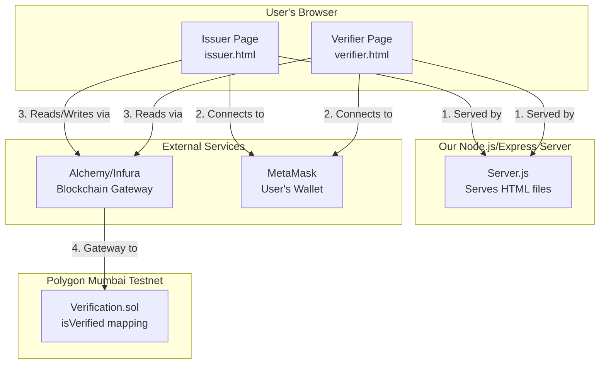

### **System Architecture: How The Parts Work in Tandem**
The entire system runs on **one single backend server**. The two web pages (`issuer.html` and `verifier.html`) are both **served by the same Node.js/Express application**. They both connect to the **same smart contract** on the **same blockchain** to perform their specific functions.

Here is a visual overview of how everything connects:


Now, let's dive into the specific roles and interactions of each component.

---

### **1. The Smart Contract (`Verification.sol`) - The "Source of Truth"**

*   **What it is:** A program deployed to the Polygon Mumbai blockchain.
*   **What it does:** It acts as a single, tamper-proof database that stores which wallet addresses (`address`) are verified (`bool true`).
*   **How it works:**
    *   It contains a `mapping`: `mapping(address => bool) public isVerified;`
    *   It has a function `issueVerification(address _user)` that an owner (the "government") can call to set `isVerified[_user] = true;`
    *   It has a function `checkVerification(address _user)` that anyone can call to read the value of `isVerified[_user]`.

**Interaction:**
*   **The Issuer Page** calls `issueVerification()` to **write** to the contract (costs gas, requires a transaction).
*   **The Verifier Page** calls `checkVerification()` to **read** from the contract (free, instant, no transaction needed).

---

### **2. The Backend (Node.js + Express Server) - The "Web Host"**

*   **What it is:** A simple server running on your laptop.
*   **What it does:**
    1.  It serves the two static HTML files (`issuer.html` and `verifier.html`) to the user's browser. This is its **only** job.
    2.  It doesn't perform the verification logic itself. It just delivers the web pages.
*   **How it works:**
    *   You'll have a file structure like this:
        ```
        /your-project-folder
        |-- server.js
        |-- issuer.html
        |-- verifier.html
        |-- package.json
        ```
    *   A simple `server.js` uses `express.static()` to make the folder available.

**Interaction:**
*   The user goes to `http://localhost:3000/issuer.html`. The server sends the `issuer.html` file to their browser.
*   The user goes to `http://localhost:3000/verifier.html`. The server sends the `verifier.html` file to their browser.

---

### **3. The Frontend (HTML Pages + Ethers.js) - The "User Interface"**

This is where the magic happens. The frontend pages, once loaded in the browser, talk directly to the blockchain.

#### **Page 1: `issuer.html` (The Government Portal Simulator)**

*   **Purpose:** To allow a user to get their wallet address verified on-chain.
*   **How it works in the browser:**
    1.  Uses **Ethers.js** to connect to the user's **MetaMask** wallet and get their address.
    2.  When the user clicks "Verify", it uses Ethers.js to create a transaction that calls the `issueVerification()` function on the smart contract.
    3.  MetaMask pops up for the user to confirm and sign the transaction.
    4.  Once the transaction is confirmed, it uses **qrcode.js** to generate a QR code containing the user's address and the contract address.

#### **Page 2: `verifier.html` (The Demo Website)**

*   **Purpose:** To check if a user's wallet address is verified on-chain.
*   **How it works in the browser:**
    1.  It offers two ways to get the user's address:
        *   **Scan QR Code:** Uses the browser's camera and a JS library to scan the QR code from the Issuer page and extract the address.
        *   **Connect Wallet:** Uses Ethers.js to connect to MetaMask and get the address directly.
    2.  It then uses Ethers.js to call the `checkVerification()` function on the smart contract.
    3.  It gets the result (`true` or `false`) directly from the blockchain and displays it to the user.

---

### **How the Flow Works: A Step-by-Step Data Journey**

**Goal: User gets verified on Page 1 and logs in on Page 2.**

1.  **User on `issuer.html`:**
    *   The page loads. The user clicks "Connect Wallet". The page (via Ethers) asks MetaMask for the user's public address. Let's say it's `0x123...`.
    *   The user clicks "Verify". The page (via Ethers) sends a transaction to the smart contract's `issueVerification(0x123...)` function.
    *   This transaction is sent via the **Alchemy** node to the **Polygon Mumbai** network.
    *   The blockchain updates its state: `isVerified[0x123...] = true`.

2.  **User on `verifier.html`:**
    *   The page loads. The user clicks "Scan QR Code" and scans the code from Step 1. The page extracts the address `0x123...` from the QR code.
    *   *Alternatively, the user clicks "Connect Wallet" and the page gets `0x123...` directly from MetaMask.*
    *   The page (via Ethers) asks the Alchemy node to query the smart contract: "What is the value of `isVerified[0x123...]`?"
    *   The Alchemy node queries the blockchain, gets the result `true`, and sends it back to the page.
    *   The page displays "✅ Verified".

### **To Answer Your Questions Directly:**

*   **Does page 1 and page 2 have a different backend?**
    *   **No.** They are both just HTML files served by the same simple Node.js server. That server's only job is to deliver those files. It does not handle any business logic.

*   **Do they check the ID using a different thing?**
    *   **No.** They both check the ID using the **same thing**: the `checkVerification()` function on the **same smart contract** on the **same blockchain**. They are both just different user interfaces for interacting with the same single source of truth.

The blockchain is the shared database. The web pages are just different apps that read from and write to that database. This is the core of decentralized architecture.
